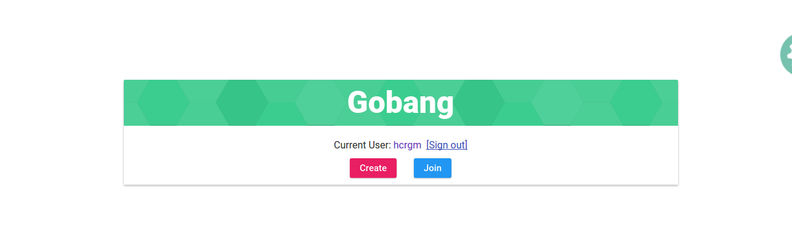
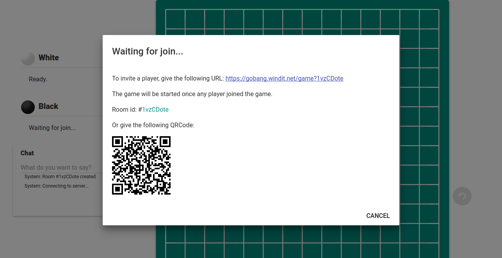
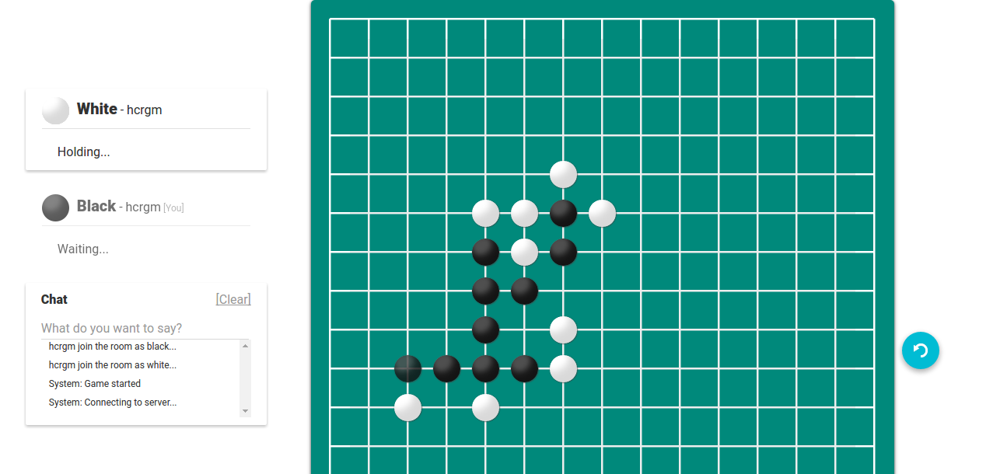
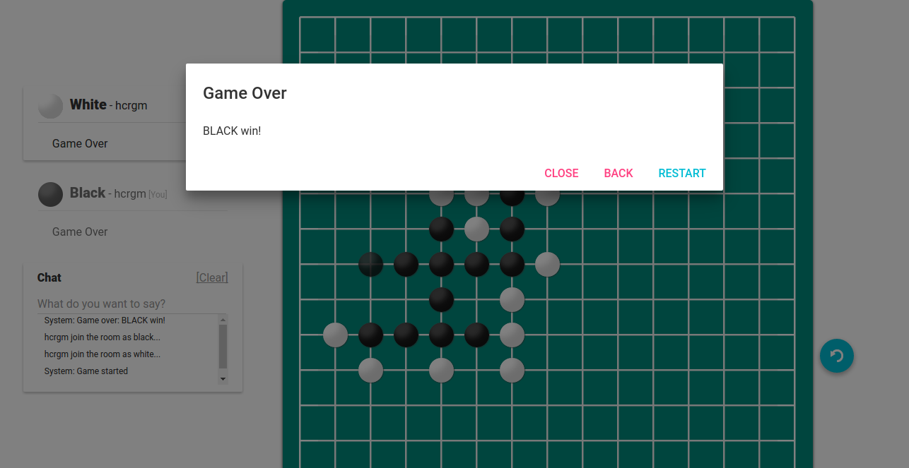

# Gobang
A multiplayer Gobang game used WebSocket.
Powered by Golang.

# Screenshots

# Getting Started
You can get the releases [here](https://github.com/hcrgm/Gobang-Go/releases)

Build this project:

1. Clone this project, then cd to this project.
2. Run `go get github.com/hcrgm/Gobang-Go`
3. Run `go build -o gobang_server gobang.go`

Then, run this program.

1. Rename `config_sample.json` to `config.json`, configure yourself by editing the `config.json` file.
2. Run `nohup ./gobang_server > gobang.log 2>&1 &` or use other way you like to run this program. 
3. Open `http://127.0.0.1:port` (default value of port is 8080) in your browser. That's all.

# License
GPLv3
